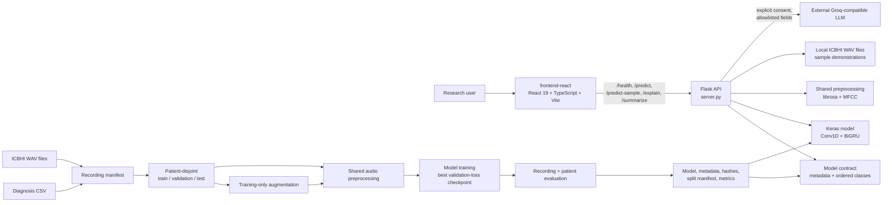
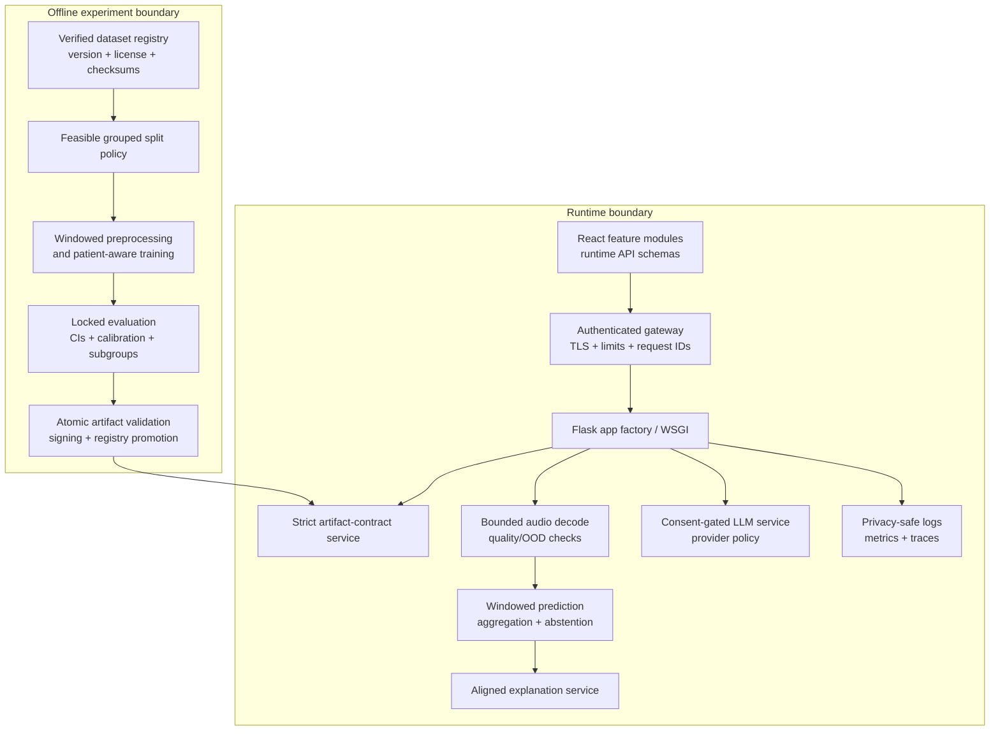

# RespiNet Architecture, Quality, and Benchmark Assessment

| Audit field | Value |
|---|---|
| Assessment date | 2026-07-31 |
| Base repository revision | `f6c869365b4ca73221c9276bf57762ca8e5c1914` |
| Worktree state | 37 pre-existing tracked files differ from the index only by line endings; `git diff --ignore-space-at-eol` reports no semantic diff |
| Canonical frontend | `frontend-react/` |
| Overall engineering maturity | **49/100 — research prototype** |
| Model performance status | **Not currently benchmarkable** |
| Deployment status | **Not release-ready and not suitable for clinical use** |

## 1. Executive summary

RespiNet has a credible research-oriented shape: a React single-page application,
a Flask inference API, shared audio preprocessing, a compact Conv1D/BiGRU model,
patient-aware training code, broad evaluation utilities, and unusually candid model,
dataset, and security documentation.

The architecture is directionally sound, but the current repository cannot support a
trustworthy disease-classification result or a production deployment. Four release
blockers dominate the assessment:

1. **The committed `patient_diagnosis.csv` is not the authentic ICBHI diagnosis
   distribution.** Its class counts contradict published ICBHI patient counts, and
   repository history contains a dummy-label generator that produces the same ID range
   using random class assignment.
2. **The advertised authentic eight-class 60/20/20 patient split is infeasible.**
   ICBHI has only one Asthma patient and two LRTI patients, so those classes cannot
   appear in three patient-disjoint partitions; the first stratified split will fail.
3. **There is no corrected model artifact or valid held-out patient benchmark.**
   `artifacts/` contains only `.gitkeep`; the checked-in H5 and its metrics are explicitly
   legacy, leakage-prone, and unverified.
4. **The documented `python server.py` entry point can overwrite metadata-backed class
   order with labels loaded from the CSV.** An eight-output model can then pass the
   dimension check while predictions are silently mapped to the wrong diseases.

The correct next move is not tuning the neural network. It is an **evidence reset**:
replace and verify the labels, redesign the scientific task around feasible class
support, remove legacy inference fallback, fix the class-order contract, and only then
produce a reproducible experiment.

### Current status at a glance

| Dimension | Status | Assessment |
|---|---|---|
| Source architecture | Partial pass | Clear training modules and shared preprocessing; oversized serving/UI modules |
| Canonical React frontend | Pass with risks | Modern stack and coherent flows; no frontend tests and a 2,173-line main feature page |
| Python syntax | Pass | All reviewed Python modules compile syntactically |
| Python lint/tests in this workspace | Not executed | Local project dependencies, Ruff, and pytest are absent |
| Data provenance | Fail | Checked-in diagnosis distribution does not match ICBHI ground truth |
| Experiment feasibility | Fail | Authentic eight-class three-way patient stratification is impossible |
| Valid model benchmark | Fail | No corrected patient-level artifact or metrics exist |
| Runtime model contract | Fail | Metadata labels can be overwritten at the documented entry point |
| Security/privacy foundations | Partial pass | Good local defaults and LLM consent; production controls are absent |
| Deployment readiness | Fail | Flask development server, no container/WSGI/auth/observability/release process |

## 2. Scope and method

This assessment covers the 84 tracked files in the current revision, including:

- Python training, evaluation, inference, and audio-processing modules;
- the Flask API and optional external-LLM integration;
- `frontend-react/` as the only active frontend;
- Python and frontend dependency definitions;
- tests, CI, environment configuration, and repository hygiene;
- model/data/security documentation;
- checked-in model, pickle, result, plot, and paper artifacts;
- relevant Git history used to establish diagnosis-file provenance.

The analyzed working tree is semantically equivalent to the base revision when
end-of-line whitespace is ignored. Existing line-ending-only changes were preserved.
This report is the only intentional tracked-content addition made by the assessment.

The older `frontend/` implementation was not used as the application frontend and was
excluded from frontend quality scoring. It was considered only as a maintenance and
repository-hygiene concern.

The assessment combined:

- source and dependency inspection;
- repository and line-count measurements;
- Git-history inspection;
- Python syntax compilation;
- lockfile-based frontend dependency installation;
- TypeScript/build validation where locally possible;
- comparison of the committed diagnosis distribution with the
  [official ICBHI database description](https://bhichallenge.med.auth.gr/ICBHI_2017_Challenge)
  and a [published respiratory-sound study/review containing patient-level class counts](https://pmc.ncbi.nlm.nih.gov/articles/PMC7795327/).

This is a software, ML-methodology, and operational-readiness assessment. It is not a
clinical validation, regulatory assessment, penetration test, or confirmation of the
medical content in the UI.

### 2.1 Key evidence map

| Finding / behavior | Primary repository evidence |
|---|---|
| Dummy diagnosis generation in history | `git show 1473cb22077d89eea83d343317cdca9d2ed3c919:main.py`, lines 7–15 |
| Current label validation cannot establish provenance | `featureExtraction.py:42-57` |
| Two-stage stratified patient split | `main.py:61-112` |
| Training-only augmentation | `featureExtraction.py:97-144`; `main.py:187-191` |
| Shared preprocessing contract | `preprocessing.py:17-95`; `server.py:35-40` |
| Intended model/evaluation metadata | `main.py:214-248` |
| Legacy H5 fallback and optional metadata | `server.py:45-68`, `130-159` |
| Optional SHA verification plus output-count-only semantic shape check | `server.py:165-191` |
| Entry-point class overwrite | `server.py:891-904` |
| Fixed 200-frame truncation | `preprocessing.py:61-67`, `70-95` |
| Full-spectrogram saliency interpolation | `server.py:742-784` |
| Frontend allows loaded legacy model | `frontend-react/src/pages/DiagnosePage.tsx:190-227`, `460-466` |
| Simulated pipeline stages | `frontend-react/src/pages/DiagnosePage.tsx:418-495`, `544-606` |
| Consent and server-side context allowlist | `server.py:285-348`, `787-829`, `833-886` |
| Historical evidence warnings | `README.md:12-22`; `MODEL_CARD.md:3-7`; `Images/training_results.txt:1-3` |

## 3. Repository profile and quantitative inventory

### 3.1 Size and composition

| Measure | Value | Interpretation |
|---|---:|---|
| Tracked files | 84 | Small repository, but several responsibilities are concentrated in large files |
| Tracked size | approximately 5.1 MB / 4.9 MiB | 5,111,719 bytes, dominated by model, PDF, plots, and duplicate legacy assets |
| Python production files | 9 | Training, evaluation, preprocessing, model, serving, and validation |
| Python production LOC | 1,790 | Compact core, but half is in `server.py` |
| Python test files | 5 | Unit-level only |
| Python test LOC | 114 | Test/source LOC ratio 6.4%; this is not code coverage |
| Python test functions | 8 | Narrow happy-path and invariant coverage |
| Canonical React source | 8,344 LOC | TS, TSX, and CSS |
| Canonical React source files | 24 | Eight pages plus shared components, stores, hooks, data, and styles |
| Legacy frontend | 3,748 LOC | Retained duplicate implementation, not used for this review |
| Flask routes | 5 | Health, prediction, sample prediction, explanation, summarization |
| Python runtime dependencies | 11 direct | Broad version ranges, no resolved lock |
| React dependencies | 7 runtime + 7 development | Lockfile v3 with integrity hashes |
| npm lockfile entries | 201 package entries | Reasonable dependency footprint for the UI |

### 3.2 Maintainability hotspots

| File | LOC | Share / concern |
|---|---:|---|
| `frontend-react/src/pages/DiagnosePage.tsx` | 2,173 | 26% of canonical UI source; state, audio capture, intake, pipeline, result, and LLM orchestration in one component |
| `frontend-react/src/styles/globals.css` | 1,775 | 21% of canonical UI source; global coupling and difficult ownership |
| `server.py` | 904 | 50.5% of Python production code; global config, model loading, audio, plots, LLM, and five routes |
| `frontend-react/src/pages/HomePage.tsx` | 582 | Large presentation component |
| `frontend-react/src/pages/ChatPage.tsx` | 516 | Rule-based medical-information content and UI in one file |

`server.py` contains 23 function/method definitions (22 top-level functions plus
`GroqError.__init__`) and approximately 89 branch nodes. Its largest route, `explain`,
is about 140 lines and combines model inference, gradients, spectrogram generation,
three image renders, consent handling, and an optional network call.

## 4. Current architecture

### 4.1 System context

### 4.2 Offline training and evaluation

The intended flow is:

1. `main.py` loads the diagnosis CSV and refuses to synthesize missing labels.
2. `featureExtraction.py` creates a deterministic recording manifest.
3. `main.py` assigns patients—not recordings—to train, validation, and test.
4. Only training recordings are augmented.
5. `preprocessing.py` resamples mono audio to 22.05 kHz and extracts 40 MFCCs,
   delta, and delta-delta coefficients.
6. Each recording becomes a `(200, 120)` sequence.
7. `model.py` applies BatchNorm, two Conv1D layers, two bidirectional GRUs,
   global average pooling, a dense layer, and an N-class softmax.
8. `train.py` selects the checkpoint by validation loss.
9. `evaluate.py` produces recording- and patient-aggregated metrics.
10. `main.py` writes a model, class/preprocessing metadata, model and split hashes,
    history, plots, and test metrics.

This separation is one of the repository's strongest design choices. In particular,
splitting before augmentation is the right protection against augmented copies crossing
partitions.

### 4.3 Model architecture benchmark

| Stage | Shape / configuration | Notes |
|---|---|---|
| Input | `(200, 120)` | 24,000 float values, 96 kB / 93.75 KiB per sample as float32 |
| Batch normalization | 120 channels | Padding is not masked |
| Conv1D 1 | 64 filters, kernel 5 | Same padding, LeakyReLU, dropout 0.2 |
| Conv1D 2 | 64 filters, kernel 3 | Same padding, LeakyReLU, dropout 0.2 |
| BiGRU 1 | 64 units per direction | Returns sequences, dropout after activation |
| BiGRU 2 | 32 units per direction | Returns sequences |
| Pooling | Global average | Aggregates real and padded frames together |
| Dense head | 64 units | LeakyReLU, dropout 0.4 |
| Output | N-class softmax | Eight outputs in the checked-in legacy H5 |
| Source parameter count | approximately 137,000 | Compact model; UI's approximate value is reasonable |
| Checked-in H5 size | approximately 1.7 MiB | No trusted ordered-label or run-provenance contract |

The tracked `model_info.txt` describes a different 79,304-parameter network. It is
correctly marked legacy, but keeping contradictory architecture evidence beside active
source increases the chance of accidental reuse.

### 4.4 Runtime API

`server.py` loads environment configuration at import time, loads metadata/class
configuration, and lazily loads a model under a process-local lock.

| Endpoint | Purpose | Main concern |
|---|---|---|
| `GET /health` | Model, dataset, class, and contract status | Returns `status: ok` even if the model is unusable; liveness/readiness are conflated |
| `POST /predict` | Multipart audio inference | Extension-only validation; synchronous decode and inference |
| `GET /predict-sample/<disease>` | Run a local dataset example | Hard-coded exclusions and deterministic first-file selection |
| `POST /explain` | Prediction, saliency, spectrograms, optional LLM text | Attribution is visually misaligned for long recordings and expensive work is synchronous |
| `POST /summarize` | Optional external narrative | Client-asserted model result, blocking external call, no authentication or quota |

Positive controls already present include:

- `127.0.0.1` default binding;
- configurable CORS;
- request-size and decoded-duration limits;
- extension allowlisting and temporary-file cleanup;
- lazy loading protected by a lock;
- optional SHA-256 verification;
- output-shape and probability checks;
- explicit external-LLM consent;
- patient-context allowlisting before external transmission;
- debug diagnostics disabled by default.

### 4.5 Canonical React frontend

`frontend-react/` is a route-based React SPA with:

- React 19, TypeScript strict mode, Vite 6, Tailwind 4;
- React Router for eight pages;
- Zustand for in-memory analysis, report, and chat state;
- Recharts for historical metric visualization;
- Framer Motion with user reduced-motion support;
- same-origin API calls by default and a Vite development proxy;
- 30-second request timeouts;
- a five-second `/health` poll;
- upload and browser audio-capture flows;
- optional de-identified LLM summary and explanation flows.

The routes are:

| Route | Responsibility |
|---|---|
| `/` | Product/research overview |
| `/diagnose` | Intake, upload/record, inference, probability display, LLM summary |
| `/diseases` | Static disease information |
| `/how-it-works` | Pipeline and model architecture |
| `/metrics` | Historical, explicitly non-clinical run metrics |
| `/chat` | Local rule-based respiratory information guide |
| `/report` | In-memory generated report |
| `/explainability` | Server-generated spectrogram/saliency and optional narrative |

The frontend correctly fails closed when the backend/model is unavailable, preserves the
recorded WebM container type, does not fabricate inference output, labels probabilities
as uncalibrated, and asks for explicit LLM consent.

However:

- inference checks `online && modelLoaded`, not `modelContract ===
  "verified-metadata"`, so the UI still permits legacy-unverified predictions;
- analysis/report state is memory-only and disappears on refresh or direct navigation;
- API responses are trusted after TypeScript casting; there is no runtime schema
  validation;
- `DiagnosePage.tsx` owns too many responsibilities and is costly to test or change;
- the UI says the GRU has “residual connections,” but `model.py` implements none;
- simulated pipeline delays can imply that browser-side stages correspond to actual
  server progress, although the backend returns one final response;
- the rule-based “Health Advisor” provides uncited disease, treatment, exercise, and
  prevention content that has not received a documented clinical review;
- there are no component, store, API-client, accessibility, or end-to-end tests;
- historical metrics are carefully caveated but remain visually prominent and could
  still be detached from their warning in screenshots or downstream reuse.

## 5. Critical evidence and scientific-validity findings

### 5.1 P0 — Diagnosis labels do not match ICBHI ground truth

The committed CSV contains exactly patient IDs 101–226, but its patient distribution
does not match published ICBHI diagnosis counts:

| Class | Repository CSV | Published ICBHI patients | Difference |
|---|---:|---:|---:|
| Asthma | 13 | 1 | +12 |
| Bronchiectasis | 13 | 7 | +6 |
| Bronchiolitis | 17 | 6 | +11 |
| COPD | 13 | 64 | -51 |
| Healthy | 21 | 26 | -5 |
| LRTI | 13 | 2 | +11 |
| Pneumonia | 18 | 6 | +12 |
| URTI | 18 | 14 | +4 |
| **Total** | **126** | **126** | — |

Git history strengthens this finding:

- the commit that added `patient_diagnosis.csv` also added code that, when the file was
  missing, created IDs 101–226 and assigned one of the eight classes using
  `np.random.choice`;
- the present CSV has that exact ID range and a near-balanced distribution typical of
  the dummy generator rather than the strongly imbalanced published data.

Regardless of whether that exact process produced the committed file, the class-count
mismatch is sufficient to conclude that it is **not the authentic ICBHI ground truth**.

Current validation checks schema, empty values, conflicts, malformed filenames, and
missing mappings. It cannot detect plausible-looking but false labels.

**Impact:** existing disease results and any new training run using this CSV are invalid.

### 5.2 P0 — The authentic eight-class split cannot run as designed

`split_by_patient` uses stratification twice to create train, validation, and test
patients. A class needs enough independent patients to survive both splits.

The authentic dataset has:

- one Asthma patient;
- two LRTI patients.

One patient cannot be divided across even two patient-disjoint partitions, and two
patients cannot populate three. Scikit-learn will reject the first stratified split for
the one-patient class.

The current split test uses 15 synthetic patients in each of eight classes, so it proves
the grouping invariant but does not exercise the authentic class distribution.

**Impact:** the README's corrected eight-class 60/20/20 experiment is not executable
against authentic labels and cannot yield an eight-class patient-level generalization
claim.

**Required decision:** obtain more patients, define a scientifically justified
class subset/merging strategy, or redesign the target to an acoustic-event task. That
decision must be documented before changing code or reporting metrics.

### 5.3 P0 — There is no valid current model benchmark

The repository contains:

- no `artifacts/latest/best_model.keras`;
- no `model_metadata.json`;
- no current split manifest;
- no valid test metrics;
- one legacy `best_model.h5`;
- historical plots and values from a sample-level split after augmentation.

The displayed historical values are:

- final training accuracy: 82.12%;
- final validation accuracy: 73.44%;
- best validation accuracy: 75.36% at epoch 48.

The documentation correctly says these values are leakage-prone and are not a
patient-level or clinical-performance estimate. They must not be compared with other
papers because the split, label provenance, task definition, and evidence contract are
not equivalent.

**Model efficacy score: not available.** Assigning an accuracy, F1, or “state of the
art” comparison would be misleading.

### 5.4 P0 — Serving entry point can silently remap output labels

At import time, `server.py` obtains ordered classes from model metadata. In the
`__main__` block, the documented startup path assigns `CLASSES = load_class_labels()`
again, replacing that order with CSV-derived ordering.

Model loading verifies the number of outputs, not the exact input/output semantic
contract. An eight-output model with different metadata ordering can therefore pass
validation while all output indices are associated with the wrong diseases.

**Impact:** silent semantic corruption of every prediction.

**Fix:** never overwrite metadata-backed classes; require strict metadata by default and
verify unique ordered labels, input shape, output shape, model hash, preprocessing,
source revision, split/data hashes, and evaluation reference before readiness.

## 6. ML pipeline assessment

### 6.1 Strengths

- Patient is the split unit.
- Splitting happens before augmentation.
- Augmentation is deterministic from a supplied random seed.
- Validation and test receive original audio only.
- Missing datasets and malformed diagnosis inputs fail closed.
- Training and serving call the same preprocessing module.
- Validation loss, not test data, selects the checkpoint.
- Test evaluation includes recording and patient aggregation.
- Evaluation utilities cover accuracy, balanced accuracy, macro precision/recall/F1,
  weighted F1, kappa, MCC, log loss, multiclass Brier score, expected calibration
  error, confusion matrix, classification report, and macro one-vs-rest AUROC.
- Intended artifacts include model and split hashes, ordered labels, preprocessing,
  source revision, and limitations.

### 6.2 Correctness and statistical risks

1. **Audio truncation:** `200 × 512 / 22050` approximates the first 4.6–4.7 seconds;
   exact coverage is affected by Librosa's centered windows. The official database
   describes 10–90 second recordings, so roughly 54–95% can be discarded. There is no
   sliding-window or recording-level window aggregation.
2. **Unmasked padding:** zero-filled frames pass through BatchNorm, convolutions, GRUs,
   and global pooling as if they were observed signal.
3. **Misaligned explainability:** a 200-step gradient vector is interpolated over the
   spectrogram of the entire recording, including audio the model never consumed.
4. **Recording-weighted training:** patients with more recordings contribute more to
   optimization, class weights, and validation loss; patient aggregation occurs only
   after training.
5. **Train/serve option drift:** optional spectral denoising is offered at inference
   but is not part of either the current training preprocessing or the historical
   training pipeline.
6. **Permissive preprocessing contract:** unknown metadata fields are dropped and
   missing values inherit current defaults; important library defaults and versions are
   not recorded.
7. **Incomplete artifact validation:** “verified-metadata” does not require a model
   hash or validate model filename, unique classes, input shape, source revision, split
   hash, or evaluation artifact.
8. **Weak revision provenance:** source revision defaults to `unknown`.
9. **Path-dependent manifest hash:** serialized path strings can make identical data
   hash differently across machines or path layouts.
10. **Single holdout only:** no grouped/nested cross-validation, patient-bootstrap
    confidence intervals, subgroup analysis, external validation, calibration, OOD
    detection, input-quality rejection, or abstention.
11. **Evaluation input validation:** probability sample count, target range, row sums,
    and complete probability bounds are not all checked.
12. **Orphan scaler:** `scaler.pkl` is unused, unverified, and unsafe to deserialize
    without trusted provenance.

### 6.3 Training memory and throughput estimate

Each feature sample contains `200 × 120` float32 values, or 96 kB / 93.75 KiB.
Training creates the original plus four augmented variants. At a nominal 60% of 920
recordings, the raw training feature tensor is approximately:

`920 × 0.60 × 5 × 200 × 120 × 4 bytes ≈ 253 MiB`

Because features are first accumulated in Python lists and then converted to an array,
peak memory can be materially higher. Feature extraction is eager, without streaming,
checksum-keyed caching, or backpressure.

## 7. API, privacy, and security assessment

### 7.1 Positive controls

- local-only bind by default;
- configurable, restricted CORS;
- upload byte and decoded-duration limits;
- no application-level upload retention under normal execution, although an abrupt
  process termination can leave a `delete=False` temporary file behind;
- probability and model-output checks;
- optional model hash verification;
- LLM consent enforced server-side;
- direct identifiers and free text excluded from the external allowlist;
- prompt tells the LLM to treat supplied data as untrusted;
- research and non-diagnostic limitations appear in documentation and UI.

### 7.2 Production blockers

- no authentication, authorization, tenant boundary, or session model;
- no rate limiting, quota, abuse protection, or concurrency control;
- no request IDs, structured logs, metrics, traces, alerts, or privacy-safe audit policy;
- no `Cache-Control: no-store` or documented security-header policy for sensitive
  responses;
- filename-extension validation without file-signature/content validation;
- compressed or hostile audio can consume resources during decode before duration is
  known;
- synchronous CPU-heavy extraction, inference, gradients, Matplotlib rendering, and
  external HTTP calls;
- external provider error bodies may be logged;
- unexpected summarization exceptions can be returned to clients;
- client-asserted model results are not checked for complete probability consistency;
- malformed JSON types can reach assumptions intended for objects;
- Flask's development server is the only included runtime;
- no production WSGI, reverse proxy, TLS, container, non-root runtime, or system-codec
  provisioning;
- no license, model license, or deployable legal basis.

The security document names many of these requirements accurately. That is good
governance, but documented missing controls are still missing controls.

## 8. Frontend architecture and product-quality assessment

### 8.1 Strengths

- modern, typed, locked frontend stack;
- clear routing and separation of pages, reusable visual components, stores, and API
  helpers;
- reduced-motion support in the application motion configuration;
- meaningful offline/model status messaging;
- actual backend failures are shown rather than replaced by mock predictions;
- request timeouts and same-origin defaults;
- audio resource cleanup for streams, animation frames, object URLs, and audio context;
- LLM consent is explicit and defaults to off;
- no `dangerouslySetInnerHTML`; lightweight rich-text renderers create React nodes;
- uncalibrated-probability and explainability warnings are visible;
- memory-only state limits long-term browser retention of patient context.

### 8.2 Risks and maintainability gaps

- the main diagnosis feature is a 2,173-line component with many interacting state
  variables and callbacks;
- global CSS is 1,775 lines;
- analysis/report data disappears on refresh and cannot be safely resumed;
- memory-only `File` state means sample explanations cannot be regenerated after route
  reload, and sample inference deliberately has no audio file for explanation;
- no runtime API schema validation; raw JSON is later assumed to contain numbers and
  maps suitable for `.toFixed()` and chart rendering;
- upload/sample controls are not protected by a single-operation state, operation ID,
  or cancellation policy, so overlapping responses can race and overwrite newer state;
- numeric input constraints are mainly HTML hints: payload construction accepts any
  finite value, drag-and-drop bypasses the file input's `accept` filter, and the browser
  performs no pre-upload size or decoded-duration check;
- no frontend error boundary;
- no automated unit, integration, browser, visual-regression, or accessibility suite;
- no ESLint or formatting gate;
- unused-local and unused-parameter checks are disabled;
- route-level code splitting is absent: the measured production build emits one
  881.02 kB minified JavaScript bundle (258.52 kB gzip) and triggers Vite's
  greater-than-500 kB chunk warning;
- health polling continues every five seconds with no backoff or page-visibility policy;
- model-contract status is presented but not enforced before inference;
- route changes do not manage document title, focus, scroll position, or announcements;
  dynamic server state, pipeline progress, errors, and chat replies lack live regions;
- medical-information content and prevalence statements lack citations and clinical
  content ownership;
- the local chat simulates a thinking delay, which can make a fixed rules engine appear
  more intelligent than it is;
- explainability sends the full structured patient context to the local API even when
  LLM reasoning is disabled, although that context is not needed for image generation;
- production hosting requirements are undefined: `BrowserRouter` needs an SPA fallback,
  and the Vite API proxy exists only during development;
- “diagnose,” “health advisor,” and treatment language can exceed the product's
  research-only positioning even with disclaimers.

## 9. Testing, CI, dependencies, and operations

### 9.1 Existing tests

The eight Python tests cover:

- zero-filled shifting;
- deterministic seeded noise;
- preprocessing feature dimension;
- pad/truncate behavior and invalid rank;
- one balanced synthetic patient split and patient grouping;
- one perfect-probability evaluation case;
- one patient-probability aggregation case.

Missing coverage includes:

- diagnosis provenance and authentic class imbalance;
- manifest validation beyond current unit paths;
- audio decoding, MFCC parity, and time stretching;
- training and artifact-writing smoke tests;
- model input/output and strict metadata contract failures;
- all five Flask routes;
- corrupt, oversized, deceptive, and hostile uploads;
- LLM consent, sanitization, failure, and prompt-injection boundaries;
- explanation alignment;
- concurrency and startup behavior;
- every frontend component, store, route, API client, and user journey.

There is no coverage measurement or threshold. The 6.4% test/source LOC ratio is a
maintenance indicator only and must not be presented as coverage.

### 9.2 CI

GitHub Actions currently runs:

- Python 3.11, `pip install -r requirements-dev.txt`, Ruff, and pytest;
- Node 20, `npm ci`, and the frontend production build.

This is a useful baseline, but:

- Python support is ambiguous: Ruff targets 3.10 while CI only executes 3.11;
- the frontend has no separate lint or test gate;
- Ruff enables only basic `E4`, `E7`, `E9`, and `F` checks;
- no coverage, typing, security scan, dependency review, secret scan, artifact smoke
  test, or runtime matrix exists;
- Actions use mutable major-version tags;
- workflow permissions, concurrency cancellation, and timeouts are not explicit.

### 9.3 Reproducibility and supply chain

Positive:

- the npm lockfile is version 3 and carries registry integrity hashes;
- `npm ci` is used in CI;
- secrets and `.env` are ignored;
- generated dataset, experiment artifacts, frontend `dist`, caches, and coverage output
  are ignored.

Gaps:

- Python dependencies are broad ranges without a resolved, hashed lock;
- `pyproject.toml` lacks project metadata, supported Python versions, and build-system
  declaration;
- `package.json` lacks an engine constraint and there is no `.nvmrc`;
- no Dependabot/Renovate, `pip-audit`, npm audit gate, CodeQL, dependency review,
  signing, provenance, or SBOM;
- `.gitignore` does not cover common virtual environments and broader nested package
  layouts;
- checked-in H5/pickle/history artifacts bypass the intended versioned artifact model.

### 9.4 Operational readiness

The repository has no:

- production WSGI entry point;
- container or infrastructure manifest;
- non-root runtime or system dependency declaration;
- deployment environments or promotion process;
- artifact registry, signing, or rollback;
- separate liveness/readiness probes;
- structured logging or observability;
- performance budget or SLO;
- backup, retention, deletion, or incident-response runbook.

## 10. Benchmark scorecard

The score below measures engineering maturity, not clinical or model efficacy.

| Area | Weight | Score | Rationale |
|---|---:|---:|---|
| Documentation and governance | 20 | 15 | Strong README/cards/security limitations; missing license, citation, ownership, and actionable security contact |
| CI and static quality gates | 15 | 10 | Both stacks checked; gates are narrow and lack coverage, frontend tests/lint, and security scanning |
| Testing and coverage | 20 | 5 | Eight useful unit tests; no route, model-contract, frontend, accessibility, or end-to-end coverage |
| Dependencies and supply chain | 15 | 7 | Strong npm lock; unlocked Python and no automated supply-chain controls |
| Maintainability | 15 | 7 | Good ML module boundaries; large server, diagnosis page, and global stylesheet |
| Build, deployment, and operations | 15 | 5 | Static frontend build and health route; no production runtime, delivery, or observability |
| **Total** | **100** | **49** | **Research prototype with good foundations, not release-ready** |

### 10.1 Model benchmark table

| Metric | Current valid result | Status |
|---|---:|---|
| Patient-level accuracy | — | Not measured with authentic labels |
| Patient-level balanced accuracy | — | Not measured |
| Macro F1 | — | Not measured |
| Per-class sensitivity/specificity | — | Not measured |
| AUROC / PR-AUC | — | Not measured |
| Calibration / Brier / ECE | — | Utilities exist; no valid result |
| Patient-bootstrap confidence intervals | — | Not implemented |
| Device/site/location subgroup performance | — | Not implemented |
| External validation | — | Not performed |
| OOD/audio-quality rejection | — | Not implemented |
| Latency/throughput/memory | — | No runtime benchmark harness |

### 10.2 Historical values that must not be used

| Value | Historical number | Why excluded |
|---|---:|---|
| Final train accuracy | 82.12% | Training data; invalid label provenance |
| Final validation accuracy | 73.44% | Sample-level split after augmentation |
| Best validation accuracy | 75.36% | Not patient-disjoint test performance |

## 11. Local verification results

| Check | Result | Notes |
|---|---|---|
| Git worktree | Dirty, line endings only | 37 pre-existing tracked files; semantic diff is empty with end-of-line whitespace ignored |
| Python version | 3.14.4 | CI uses 3.11; local ML stack is not installed |
| Python syntax compile | Pass | Production modules and tests compiled syntactically |
| Ruff | Not run | Module not installed locally |
| pytest | Not run | pytest and project ML dependencies not installed locally |
| Model inference | Not run | No trusted metadata-backed artifact or local runtime stack |
| `npm ci` | Pass | Lockfile-based restore completed; 133 packages installed |
| `npm ls --depth=0` | Pass | Clean resolved dependency tree |
| React typecheck | Pass | 41.78 s; maximum RSS 344,276 KiB on the OneDrive-backed workspace |
| React production build | Pass with warning | 385.71 s total; 2,588 modules; maximum RSS 524,932 KiB |
| Frontend JavaScript | 881.02 kB minified / 258.52 kB gzip | One eager bundle; Vite emitted its 500 kB chunk warning |
| Frontend CSS | 36.41 kB minified / 9.05 kB gzip | Single emitted stylesheet |
| Frontend HTML | 0.61 kB / 0.37 kB gzip | Static Vite entry document |
| `git diff --check` | Existing noise | Reports CRLF/trailing-whitespace noise in the pre-existing line-ending-only diff |
| Report-only whitespace check | Pass | `git diff --check -- ARCHITECTURE_AND_BENCHMARK_REPORT.md` |

The inability to run Python tests locally is an environment limitation, not a test pass.
CI configuration shows the intended commands, but this assessment does not treat
configuration as evidence of a current successful CI run.

The measured frontend command times and memory are workstation/workspace observations,
not portable performance targets. The emitted asset sizes and single-chunk warning are
the more reproducible build outputs.

## 12. Prioritized remediation plan

### Phase 0 — Evidence reset and fail-closed behavior

1. Quarantine `patient_diagnosis.csv`, `best_model.h5`, `scaler.pkl`, historical plots,
   summaries, and the paper from active runtime/evidence paths.
2. Acquire the authorized ICBHI diagnosis file, record its source/version/license, and
   retain a SHA-256 checksum.
3. Add dataset-provenance validation: expected ID set, authentic class distribution,
   diagnosis checksum, audio inventory/checksums, and explicit version.
4. Decide and document a scientifically feasible task. Do not retain an eight-class
   three-way patient split without enough independent patients per class.
5. Remove the `CLASSES` overwrite in the `server.py` entry point.
6. Make strict metadata mandatory and refuse to serve the legacy fallback.
7. Disable frontend inference unless `/ready` confirms a fully verified artifact.

### Phase 1 — Reproducible and statistically valid experiment

8. Define supported Python/Node versions and create a resolved, hashed Python lock.
9. Capture complete run provenance: source revision, dirty-tree state, command,
   dependency versions, platform/hardware, random/deterministic settings, dataset and
   diagnosis checksums.
10. Segment or window long recordings, aggregate windows at recording and patient level,
    and mask padding explicitly.
11. Balance sampling/loss and checkpoint selection at the patient level.
12. Use grouped evaluation appropriate to the redesigned task, keep an untouched test
    set where statistically supportable, and add patient-bootstrap confidence intervals.
13. Add calibration, audio-quality checks, silence/OOD rejection, and abstention.
14. Align explanation output only with frames actually processed and validate the
    attribution method.
15. Stage artifacts in a temporary run directory, validate the complete contract, then
    atomically promote and sign the artifact.

### Phase 2 — Application quality

16. Refactor Flask into an app factory with model-contract, audio, prediction,
    explanation, and LLM services.
17. Split `DiagnosePage` into intake, capture, inference, result, report, and consent
    feature modules; modularize global styles.
18. Introduce shared API schemas and runtime validation on both sides.
19. Add backend route/contract tests and frontend unit/integration tests.
20. Add Playwright smoke and accessibility flows for upload, record, offline state,
    prediction failure, consent, report, and explanation.
21. Remove inaccurate UI architecture claims and obtain clinical review/citations for
    all disease, prevalence, treatment, prevention, and emergency-language content.
22. Rename product language away from “diagnose” and “health advisor” unless a formal
    clinical/product review approves those claims.

### Phase 3 — Production engineering, only after valid evidence

23. Add a production WSGI server and reproducible container with required audio codecs,
    non-root execution, and immutable artifact references.
24. Add authentication, authorization, rate limits, upload/content validation, bounded
    decoding, request IDs, no-store responses, and security headers.
25. Add structured privacy-safe logs, metrics, traces, alerts, and separate `/live` and
    `/ready`.
26. Add dependency/security scanning, secret scanning, SBOM, signed artifacts, immutable
    Action revisions, and least-privilege workflow permissions.
27. Add staging promotion, smoke tests, rollback, retention/deletion policies, and
    incident response.
28. Add `LICENSE`, `CITATION.cff`, explicit dataset/model license records,
    `CONTRIBUTING.md`, `CODEOWNERS`, and a monitored private security contact.

## 13. Recommended target architecture

This design keeps experiment evidence, artifact promotion, and online serving as
separate trust boundaries. A model is not “ready” merely because a file exists; it is
ready only after the complete signed contract passes.

## 14. Release acceptance gates

| Gate | Minimum evidence |
|---|---|
| Dataset | Authorized source, version, license, checksum, authentic diagnosis distribution |
| Scientific task | Documented class support and feasible patient-disjoint evaluation |
| Split | Automated no-overlap and authentic-distribution tests |
| Artifact | Model hash, ordered unique classes, exact input/output shapes, preprocessing, source/data/split hashes, environment, evaluation reference |
| Model evidence | Locked patient-level metrics, per-class results, uncertainty intervals, calibration, subgroup/failure analysis |
| Runtime | No legacy fallback; strict readiness failure on any contract mismatch |
| Backend quality | Route, upload, metadata, LLM privacy, concurrency, and startup tests |
| Frontend quality | Typecheck, lint, unit/integration tests, browser smoke, accessibility checks |
| Security | Auth, authorization, rate limiting, bounded decode, no-store, TLS, threat/privacy reviews |
| Operations | Production WSGI/container, observability, SLOs, deployment smoke, rollback |
| Governance | License, citation, owners, security contact, dataset/model usage terms |

## 15. Suggested measurable benchmark suite

Once the data and task blockers are resolved, benchmark:

### Model and statistical quality

- patient-level balanced accuracy and macro F1;
- per-class sensitivity, specificity, precision, F1, AUROC, and PR-AUC;
- log loss, Brier score, ECE, and reliability diagrams;
- patient-bootstrap 95% confidence intervals;
- device, site, chest location, age, sex, and audio-quality subgroups;
- window-to-recording and recording-to-patient aggregation choices;
- calibrated abstention coverage versus error;
- external and out-of-distribution performance.

### Runtime performance

- model cold-load time;
- p50/p95/p99 `/predict` latency by audio duration and format;
- p50/p95 `/explain` latency;
- requests per second and concurrent-request failure rate;
- peak process RAM during decode, prediction, and explanation;
- training feature-extraction throughput and peak RAM;
- compressed-audio abuse limits;
- frontend initial JS/CSS transfer, parse, and route-interaction time.

### Reliability and operations

- readiness success/failure for every artifact-contract mutation;
- startup and rollback time;
- error rate by endpoint;
- external-LLM timeout/failure behavior;
- no-retention and no-store verification;
- accessibility conformance for the primary user flows.

No target numbers should be invented before the deployment environment, user population,
audio-duration policy, and scientific task are fixed. Establish baselines first, then
set budgets tied to intended use.

## 16. Final assessment

RespiNet's corrected source is a meaningful improvement over the legacy sample-split
implementation. The code shows awareness of patient leakage, preprocessing contracts,
artifact hashes, calibration metrics, privacy minimization, and the limits of historical
results.

Those foundations are outweighed by invalid ground-truth provenance and an infeasible
eight-class experiment design. Until those are resolved, the application should be
treated as a **UI and pipeline research prototype only**. It should not expose legacy
disease predictions as a working model, and no current accuracy value should be used to
describe its performance.

The shortest safe path is:

1. reset the data/evidence boundary;
2. define a feasible research target;
3. enforce a strict, fail-closed artifact contract;
4. produce a valid patient-level experiment;
5. add application tests and production controls;
6. only then consider deployment or performance claims.
