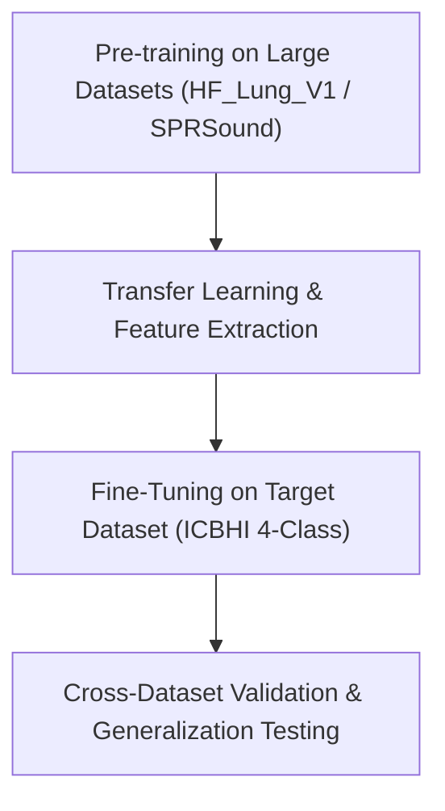

# Alternative Respiratory Audio Datasets & Benchmark Evaluation

**Purpose:** Comprehensive guide on alternative, larger, and supplementary respiratory sound datasets to overcome the limitations of the ICBHI 2017 Respiratory Sound Database.

---

## 1. Why Look Beyond ICBHI 2017?

The ICBHI 2017 Respiratory Sound Database has long served as the primary benchmark for lung sound classification. However, for deep learning models, it introduces severe bottlenecks:
1. **Small Patient Count:** Contains only **126 patients** total.
2. **Extreme Class Imbalance:** COPD accounts for >70% of all recordings, while classes like Asthma (1 patient) and LRTI (2 patients) are virtually non-existent.
3. **High Acoustic Noise & Sensor Variation:** Recordings vary across consumer microphones, WelchAllyn, Meditron, and 3M Littmann stethoscopes without standardized gains.

To build clinically credible and generalizable models, leveraging **larger alternative datasets** or adopting **multi-dataset pre-training** is highly recommended.

---

## 2. Top Alternative & Supplementary Datasets

### 1. SPRSound (SJTU Paediatric Respiratory Sound Database) ⭐ *Top Recommendation*
- **Source:** Shanghai Jiao Tong University & IEEE BioCAS 2022/2023 Challenge.
- **Scale:** **2,683 recordings** and **9,000+ sound events** across 292 participants.
- **Clinical Quality:** Annotated by a panel of 11 experienced paediatric physicians to establish a gold-standard reference.
- **Why it's better:** Highly standardized recording protocol, large patient cohort, and clean event-level annotations for adventitious sounds (wheezes, crackles, rhonchi, stridor).
- **Link:** [SPRSound GitHub Repository](https://github.com/SJTU-AIORGAN/SPRSound)

### 2. HF_Lung (HF_Lung_V1 Database) ⭐ *Best for Deep Sequence Models*
- **Source:** Open-access lung sound database for deep learning benchmark development.
- **Scale:** **9,765 audio files** (15 seconds each).
- **Quality:** Structured labels for breath phases (inhalation vs. exhalation) and adventitious sounds (wheezes, crackles, stridor, rhonchi).
- **Why it's better:** Almost **10x larger** than ICBHI in structured audio slice volume, making it ideal for training sequence architectures (Conv1D, BiGRU, Transformers).
- **Link:** [HF_Lung Database](https://github.com/HF-Lung-Database)

### 3. Kaggle Asthma Detection Dataset (Version 2)
- **Source:** Curated Kaggle respiratory audio dataset.
- **Scale:** **1,211 audio samples** (1.5s – 5s duration each).
- **Structure:** Pre-balanced into 5 distinct clinical categories: *Asthma, Bronchial, COPD, Healthy, and Pneumonia*.
- **Why it's better:** Solves the class imbalance issue directly by providing balanced sample volumes per class.
- **Link:** [Kaggle Asthma Detection Dataset V2](https://www.kaggle.com/datasets/mohammedtawfikmusaed/asthma-detection-dataset-version-2)

### 4. COUGHVID & Coswara Datasets
- **Source:** EPFL (Switzerland) & Indian Institute of Science (IISc Bangalore).
- **Scale:** **25,000+ crowdsourced audio recordings** (coughing, breathing, counting, vowels).
- **Clinical Annotations:** Metadata includes Asthma, COPD, COVID-19, Pneumonia, and Healthy controls.
- **Why it's better:** Massive sample size suited for self-supervised pre-training or audio embedding extraction.
- **Link:** [COUGHVID EPFL](https://coughvid.epfl.ch/) | [Coswara IISc](https://coswara.iisc.ac.in/)

---

## 3. Dataset Comparison Matrix

| Dataset | Total Audio Volume | Patient Count | Primary Class Categories | Key Benchmark Strength |
| :--- | :---: | :---: | :--- | :--- |
| **ICBHI 2017** *(Current)* | 920 recordings (~5.5 hrs) | 126 | COPD, Healthy, URTI, Pneumonia, etc. | Widespread historical adoption |
| **SPRSound** | **2,683 recordings** (~9,000 events) | 292 | Rhonchi, Wheeze, Crackle, Stridor, Healthy | Expert physician annotations |
| **HF_Lung_V1** | **9,765 audio files** (15s each) | 100+ | Inhalation/Exhalation, Adventitious sounds | **10x volume**, uniform 15s clips |
| **Asthma Detection V2** | 1,211 clips | Multi-center | Asthma, Bronchial, COPD, Healthy, Pneumonia | **Pre-balanced class folders** |
| **COUGHVID / Coswara** | **25,000+ recordings** | 10,000+ | Cough, Breath, COVID-19, Asthma, Healthy | Massive scale for pre-training |

---

## 4. Recommended Multi-Dataset Roadmap

1. **Step 1 (Pre-training):** Pre-train your RespiNet architecture (Conv1D + BiGRU) on **HF_Lung_V1** or **SPRSound** to learn robust representations of respiratory acoustic dynamics.
2. **Step 2 (Fine-tuning):** Fine-tune the classifier head on the target ICBHI dataset using 4-class grouping and Focal Loss.
3. **Step 3 (Cross-Dataset Benchmarking):** Evaluate the fine-tuned model on an untouched partition of SPRSound to prove real-world clinical generalization in your final project report.
