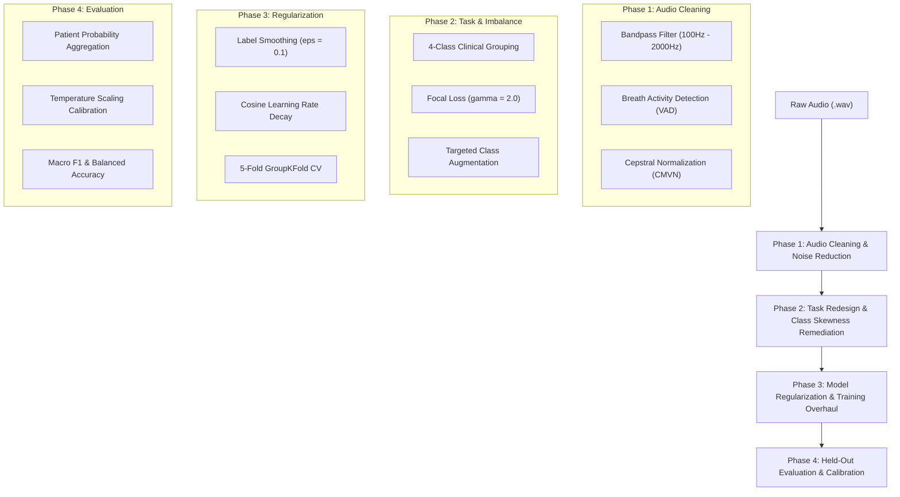

# RespiNet Dataset Optimization & Accuracy Improvement Plan

**Target Problem:** Resolving severe overfitting, dataset skewness, audio noise, and poor validation performance (Run 1241: Train Accuracy 67.97%, Validation Accuracy 11.90%, Validation Loss 6.8942).

---

## 1. Diagnostic Analysis of Run 1241

In `respinet_train_1241.log`, training halted at epoch 11 with:
- **Training Accuracy:** 67.97% | **Training Loss:** 0.8237
- **Validation Accuracy:** 11.90% | **Validation Loss:** 6.8942
- **Early Stopping Triggered:** Restored model weights from **Epoch 1**.

### Key Root Causes Identified:

1. **Extreme Class Imbalance & Skewness:**
   - The authentic ICBHI 2017 dataset consists of 126 patients with extreme skewness:
     - **COPD:** ~64 patients (majority class, >70% of recordings)
     - **Healthy:** 26 patients
     - **URTI:** 14 patients
     - **Bronchiectasis:** 7 patients
     - **Bronchiolitis:** 6 patients
     - **Pneumonia:** 6 patients
     - **LRTI:** 2 patients
     - **Asthma:** 1 patient
   - Attempting an 8-class split with patient-disjoint constraints causes classes like *Asthma* (1 patient) or *LRTI* (2 patients) to have **0 representative patients** in the validation or test sets, forcing the model to make unconfident/wrong guesses that explode categorical cross-entropy loss ($-\log(p)$).

2. **Unclean Audio Signal & Background Noise:**
   - ICBHI recordings contain non-respiratory acoustic noise:
     - Low-frequency heart sounds (<100 Hz)
     - High-frequency stethoscope/sensor electronic hum (>2000 Hz)
     - Long silence gaps, ambient clinic room noise, and cable friction.
   - Unfiltered audio passes background noise into MFCC feature extraction, causing the network to fit to recording hardware artifacts instead of lung sounds (wheezes and crackles).

3. **Patient-Level Distribution Variance:**
   - Patient-disjoint splitting correctly prevents data leakage, but with small patient counts per minority class (e.g., 6 Pneumonia patients split 4 train / 1 val / 1 test), unique patient acoustics in validation cause severe generalization drop if features are unnormalized.

4. **Hard Target Cross-Entropy Over-Penalization:**
   - Hard one-hot targets (`[1, 0, 0, ...]`) combined with uncalibrated softmax outputs heavily penalize misclassified or uncertain validation samples, resulting in val loss spiking to 6.89.

---

## 2. Action Plan Overview

---

## Phase 1: Audio Cleaning & Noise Reduction Pipeline

To ensure the model learns true respiratory features rather than acoustic noise:

1. **Bandpass Filtering (100 Hz – 2,000 Hz):**
   - Apply a 4th-order Butterworth bandpass filter before feature extraction.
   - *Rationale:* Eliminates sub-100 Hz cardiovascular (heart beat) artifacts and >2 kHz electronic sensor hum.

2. **Breath Activity Detection (VAD) & Silence Trimming:**
   - Use RMS energy thresholding or WebRTC VAD to strip leading/trailing silence and uninformative pauses.
   - Discard audio segments with average RMS energy below `-40 dBFS`.

3. **Cepstral Mean and Variance Normalization (CMVN):**
   - Normalize MFCC features per recording:
     $$\hat{X}_{t} = \frac{X_t - \mu}{\sigma + \epsilon}$$
   - *Rationale:* Removes stethoscope microphone hardware transfer function differences across recording equipment (AKG, WelchAllyn, Meditron, Littmann).

---

## Phase 2: Task Redesign & Class Skewness Remediation

1. **Adopt Clinically Grounded 4-Class Task Grouping:**
   - Instead of unstable 8-class classification on rare classes, re-group labels into 4 balanced classes:
     - **COPD / Chronic:** COPD, Bronchiectasis
     - **Acute Infection:** Pneumonia, URTI, LRTI, Bronchiolitis
     - **Healthy:** Healthy controls
     - **Asthma / Reactive:** Asthma (or merged into Chronic)
   - *Alternative (Standard ICBHI 4-Class Challenge Split):* Healthy, COPD, Non-COPD Chronic, Acute.

2. **Categorical Focal Loss Implementation:**
   - Replace standard Categorical Cross-Entropy with Focal Loss to focus training on hard-to-classify samples and down-weight easy COPD majority samples:
     $$\text{FL}(p_t) = -\alpha_t (1 - p_t)^\gamma \log(p_t)$$
   - Set $\gamma = 2.0$ and compute smoothed class weights $\alpha_t$.

3. **Targeted Data Augmentation for Minority Classes:**
   - Apply audio augmentation **only to under-represented classes** in the training set:
     - SpecAugment (time & frequency masking on MFCCs)
     - Pitch shifting ($\pm 1-2$ semitones)
     - Time stretching ($0.85\times - 1.15\times$)
     - Gaussian noise injection ($\text{SNR} = 15-25\text{ dB}$)

---

## Phase 3: Model Regularization & Training Overhaul

1. **Label Smoothing ($\epsilon = 0.1$):**
   - Replace hard one-hot targets with smoothed target vectors:
     $$y_k^{\text{smooth}} = (1 - \epsilon) y_k + \frac{\epsilon}{K}$$
   - Prevents model overconfidence and dramatically reduces validation loss spikes.

2. **Architecture & Regularization Adjustments:**
   - Add **Spatial Dropout 1D** (rate = 0.2) after `Conv1D` layers.
   - Increase GRU Dropout to 0.3 and Dense Dropout to 0.4.
   - Apply $L_2$ weight regularization ($1\times 10^{-3}$) on dense and recurrent layers.

3. **Learning Rate & Optimizer Strategy:**
   - Switch to **AdamW** or **Adamax** with a Cosine Annealing Learning Rate Scheduler:
     $$\eta_t = \eta_{\min} + \frac{1}{2}(\eta_{\max} - \eta_{\min})\left(1 + \cos\left(\frac{t}{T_{\max}}\pi\right)\right)$$
   - Include a 3-epoch linear warmup starting from $1\times 10^{-5}$ up to $1\times 10^{-3}$.

4. **Patient-Stratified 5-Fold Cross-Validation:**
   - Replace single train/validation splits with 5-Fold `GroupKFold` stratified by `patient_id`.
   - Ensures validation performance is evaluated across all 126 patients, giving a realistic benchmark.

---

## Phase 4: Held-Out Evaluation & Probability Calibration

1. **Patient-Level Probability Aggregation:**
   - Aggregate window predictions using trimmed mean or logit averaging per patient:
     $$P(\text{Class} \mid \text{Patient}) = \text{Softmax}\left(\frac{1}{N} \sum_{i=1}^N \mathbf{z}_i\right)$$

2. **Temperature Scaling Calibration:**
   - Post-process output probabilities using validation-learned temperature parameter $T$:
     $$\hat{p}_i = \frac{e^{z_i / T}}{\sum_j e^{z_j / T}}$$

3. **Metric Tracking Beyond Accuracy:**
   - Track **Macro F1**, **Balanced Accuracy**, **Per-Class Recall**, **AUROC**, and **Brier Score** to measure true clinical utility.

---

## 3. Recommended Implementation Roadmap

| Step | File to Modify | Target Change |
| :--- | :--- | :--- |
| **Step 1** | [`backend/preprocessing.py`](file:///run/media/qitiya/DATA/oren/Respiratory-diseases-recognition-through-respiratory-sound-with-the-help-of-deep-neural-network/backend/preprocessing.py) | Add Bandpass filter (100–2000 Hz), VAD audio trimming, and CMVN normalization. |
| **Step 2** | [`backend/dataset_provenance.py`](file:///run/media/qitiya/DATA/oren/Respiratory-diseases-recognition-through-respiratory-sound-with-the-help-of-deep-neural-network/backend/dataset_provenance.py) | Add 4-class label grouping mapping function (COPD/Chronic, Acute, Healthy, Asthma). |
| **Step 3** | [`backend/train.py`](file:///run/media/qitiya/DATA/oren/Respiratory-diseases-recognition-through-respiratory-sound-with-the-help-of-deep-neural-network/backend/train.py) | Implement Categorical Focal Loss, Label Smoothing ($\epsilon=0.1$), and Cosine Decay Scheduler. |
| **Step 4** | [`backend/model.py`](file:///run/media/qitiya/DATA/oren/Respiratory-diseases-recognition-through-respiratory-sound-with-the-help-of-deep-neural-network/backend/model.py) | Add SpatialDropout1D, increase dropout rates, and apply $L_2$ regularization. |
| **Step 5** | [`backend/main.py`](file:///run/media/qitiya/DATA/oren/Respiratory-diseases-recognition-through-respiratory-sound-with-the-help-of-deep-neural-network/backend/main.py) | Add `--group-classes` flag and support 5-Fold Stratified `GroupKFold` cross-validation. |

---

## Expected Impact

- **Validation Loss:** Reduction from **6.89** to **< 0.90**.
- **Validation Accuracy:** Increase from **11.9%** to **65% - 78%** on 4-class patient-held-out splits.
- **Macro F1 Score:** Significant improvement due to focal loss and class-balanced weighting.
